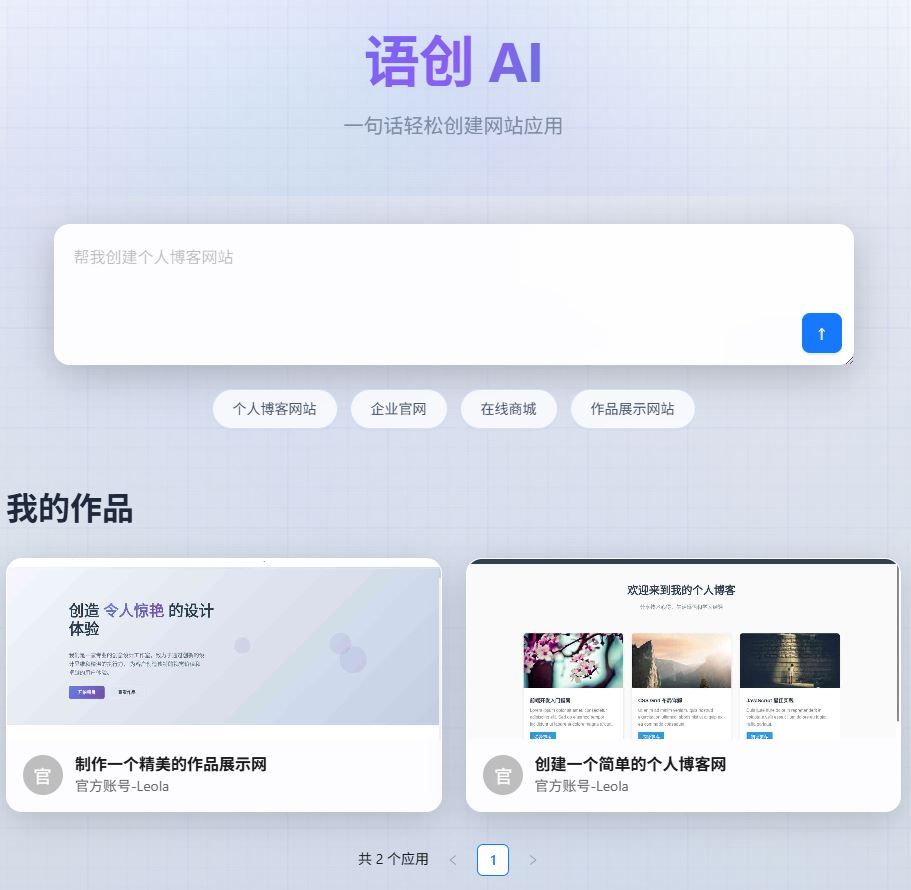
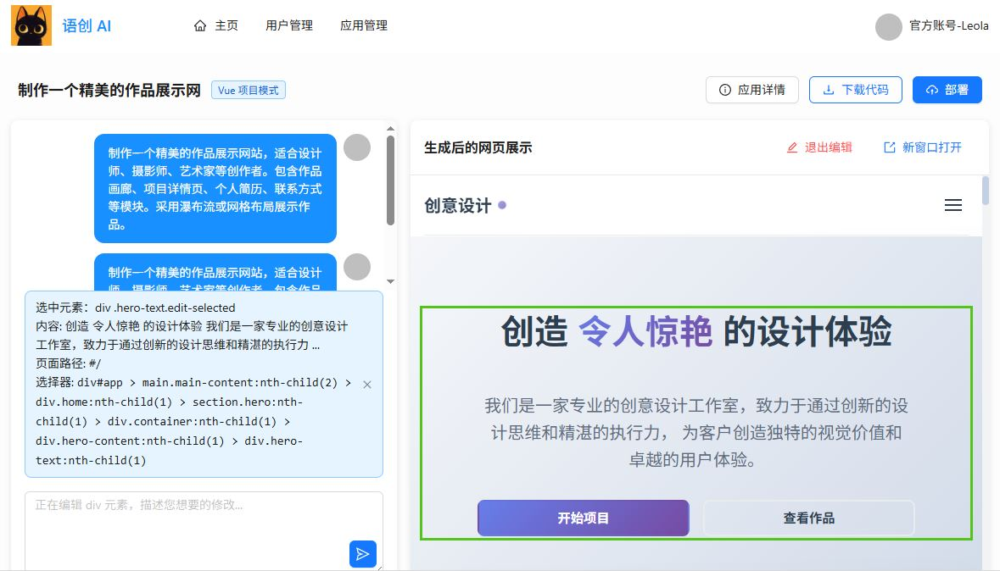
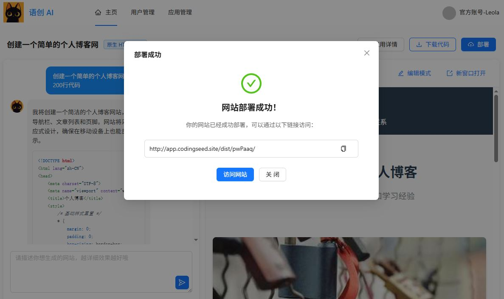
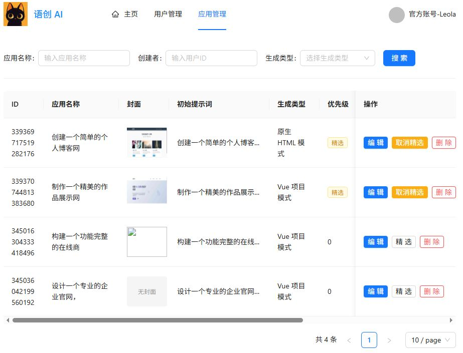

# 语创 AI 零代码应用生成平台

  
  
  
  

一个功能强大的AI代码生成平台，基于Spring Boot 3.5.4和Vue 3构建，集成DeepSeek AI模型，提供智能化的HTML、多文件项目和Vue应用生成服务。

## 🚀 项目概述

语创 AI 零代码应用生成平台是一个现代化的AI驱动代码生成平台，旨在通过人工智能技术简化和加速软件开发流程。系统支持多种代码生成场景，从简单的HTML页面到复杂的多文件项目结构，为开发者提供高效、智能的代码生成解决方案。

### ✨ 核心特性

- **🤖 AI驱动生成**: 集成DeepSeek Reasoner和Qwen Turbo模型，提供高质量代码生成
- **🔄 实时流式输出**: 基于SSE(Server-Sent Events)的实时代码生成进度展示
- **📱 全栈架构**: Spring Boot后端 + Vue 3前端的现代化全栈解决方案
- **🎯 多场景支持**: HTML页面、多文件项目、Vue应用等多种生成类型
- **📊 监控系统**: 集成Prometheus指标监控和Grafana可视化
- **☁️ 云端集成**: 腾讯云COS存储支持，支持生成文件的云端存储和部署
- **🔧 智能工具**: 网页截图、项目下载、代码预览等实用功能

### 4 大核心能力

1）智能代码生成：用户输入需求描述，AI 自动分析并选择合适的生成策略，通过工具调用生成代码文件，采用流式输出让用户实时看到 AI 的执行过程。

2）可视化编辑：生成的应用将实时展示，可以进入编辑模式，自由选择网页元素并且和 AI 对话来快速修改页面，直到满意为止。

3）一键部署分享：可以将生成的应用一键部署到云端并自动截取封面图，获得可访问的地址进行分享，同时支持完整项目源码下载。

4）企业级管理：提供用户管理、应用管理、系统监控、业务指标监控等后台功能，管理员可以设置精选应用、监控 AI 调用情况和系统性能。

### 项目架构

功能模块：

核心业务流程：

架构设计：

